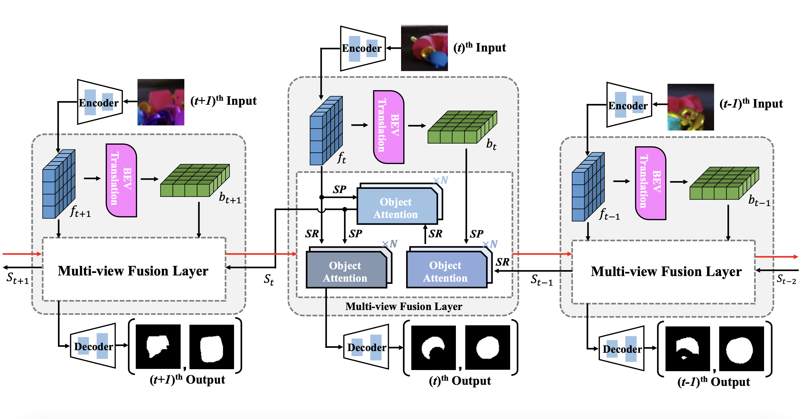
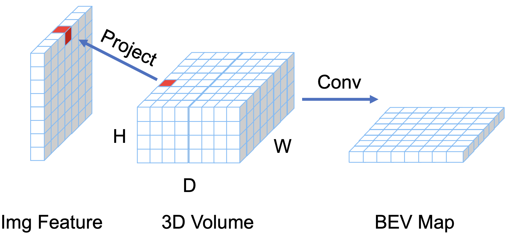
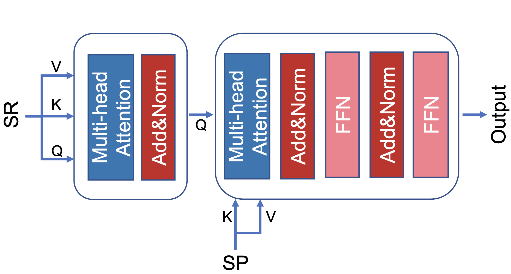

# Rethinking Amodal Video Segmentation from Learning Supervised Signals with Object-centric Representation
[Ke Fan](https://github.com/kfan21)\*, [Jingshi Lei](https://github.com/cc-crow)\*, [Xuelin Qian†](https://naiq.github.io/), Miaopeng Yu, [Tianjun Xiao†](https://tianjunxiao.com/), [Tong He](https://hetong007.github.io/), [Zheng Zhang](https://www.amazon.science/author/zheng-zhang), [Yanwei Fu](https://yanweifu.github.io/)

# Introduction

<div style="display: flex;">
     
    
</div>

<div style="text-align: justify">
<strong>EoRaS</strong> (<strong>E</strong>fficient <strong>o</strong>bject-centric <strong>R</strong>epresentation <strong>a</strong>modal <strong>S</strong>egmentation) is a framework designed for supervised video amodal segementation. The videos are first encoded by a convolutional neural network to get the front-view features. Then a translation module is used to project front-view features into the Bird’s-Eye View (BEV), which introduces 3D information to improve current feature quality. The front-view features and BEV features across the frames are integrated by a multi-view fusion layer based temporal module which is equipped with a set of object slots and interacts with features from different views by attention mechanism. Finally, the integrated front-view features are decoded into the visible and amodal masks.
<div>

# Environment Setup

```bash
conda create --name EoRaS python=3.9
conda install pytorch==1.13.1 torchvision==0.14.1 torchaudio==0.13.1 pytorch-cuda=11.7 -c pytorch -c nvidia
pip install -r requirements.txt
```


# Code and Checkpoints
The code of EoRaS will be release upon passing the review of Amazon.
| Dataset | $\text{mIoU}_{full}$ |  $\text{mIoU}_{occ}$  | checkpoint |
|---------|:---:|:---:|------------|
| [MOVI-B](https://data.dgl.ai/dataset/EoRas/MOVi-B.tar.gz)  | 79.22 | 47.89             | [Link](https://data.dgl.ai/dataset/EoRas/checkpoints/wd_5e-4_full_wobevgt_bid_vislam%3D1_occlam%3D0_bevlambda%3D0_movib_slot8_possincos/checkpoint-0050.pth.gz)              |
| [MOVI-D](https://data.dgl.ai/dataset/EoRas/MOVi-D.tar.gz)  | 69.44 | 36.96             | [Link](https://data.dgl.ai/dataset/EoRas/checkpoints/wd_5e-4_full_wobevgt_bid_vislam%3D1_occlam%3D0_bevlambda%3D0_movid_slot8_possincos/checkpoint-0050.pth.gz)             |
| [KITTI](https://dgl-data.s3.us-west-2.amazonaws.com/dataset/SaVos_release/KINS_Video_Car/KINS_Video_Car.zip)   | 87.07 | 52.00             | [Link](https://data.dgl.ai/dataset/EoRas/checkpoints/wd_5e-4_full_wobevgt_bid_vislam%3D1_occlam%3D0_bevlambda%3D0_kitti_slot8_possincos/checkpoint-0050.pth.gz)              |

# Running Experiments
## MOVI-B
```bash
savedir=/home/ubuntu/GitLab/Movi-clean/experiments
name=wd_5e-4_full_wobevgt_bid_vislam=1_occlam=0_bevlambda=0_movib_slot8_possincos
python -m torch.distributed.launch --nproc_per_node 4 main_movi.py \
        --savedir ${savedir}  --name $name \
        --vis_lambda 1.0 --occ_lambda 0.0 --bev_lambda 0.0 --wd 5e-4 --epochs 50 --seq_len 12 --lr 1e-5 \
        --num_slot 8 --enlarge_coef 2\
        --decoder fm+vm  --pos_type sincos --dataset movib_bev

CUDA_VISIBLE_DEVICES=0 python -m torch.distributed.launch test_movi.py  \
        --savedir ${savedir} --name $name \
        --param ${savedir}/$name/checkpoint-0050.pth.gz \
        --num_slot 8 --enlarge_coef 2 \
        --decoder fm+vm  --pos_type sincos --dataset movib_bev
```
## MOVI-D
```bash
savedir=/home/ubuntu/GitLab/Movi-clean/experiments
name=wd_5e-4_full_wobevgt_bid_vislam=1_occlam=0_bevlambda=0_movid_slot8_possincos
python -m torch.distributed.launch --nproc_per_node 4 main_movi.py \
        --savedir ${savedir} --name $name \
        --vis_lambda 1.0 --occ_lambda 0.0 --bev_lambda 0.0 --wd 5e-4 --epochs 50 --seq_len 12 --lr 1e-5 \
        --num_slot 8 --enlarge_coef 2\
        --decoder fm+vm  --pos_type sincos --dataset movid_bev

CUDA_VISIBLE_DEVICES=0 python -m torch.distributed.launch --master_port 12345 test_movi.py  \
        --savedir ${savedir} --name $name \
        --param ${savedir}/$name/checkpoint-0050.pth.gz \
        --num_slot 8 --enlarge_coef 2 \
        --decoder fm+vm  --pos_type sincos --dataset movid_bev
```
## KITTI
```bash
savedir=/home/ubuntu/GitLab/Movi-clean/experiments
name=wd_5e-4_full_wobevgt_bid_vislam=1_occlam=0_bevlambda=0_kitti_slot8_possincos
python -m torch.distributed.launch --nproc_per_node 4 main_kitti.py \
        --savedir ${savedir} --name $name \
        --vis_lambda 1.0 --wd 5e-4 --epochs 51 --seq_len 12 --lr 1e-4 \
        --num_slot 8 --enlarge_coef 2  --save_interval 5 \
        --decoder fm+vm  --pos_type sincos

CUDA_VISIBLE_DEVICES=0 python -m torch.distributed.launch test_kitti.py \
        --savedir ${savedir} --name $name \
        --param ${savedir}/$name/checkpoint-0050.pth.gz \
        --num_slot 8 --enlarge_coef 2 \
        --decoder fm+vm  --pos_type sincos
```
# Citation
If you find our paper useful for your research and applications, please cite using this BibTeX:

```Bibtex
@InProceedings{Fan_2023_ICCV,
    author    = {Fan, Ke and Lei, Jingshi and Qian, Xuelin and Yu, Miaopeng and Xiao, Tianjun and He, Tong and Zhang, Zheng and Fu, Yanwei},
    title     = {Rethinking Amodal Video Segmentation from Learning Supervised Signals with Object-centric Representation},
    booktitle = {Proceedings of the IEEE/CVF International Conference on Computer Vision (ICCV)},
    month     = {October},
    year      = {2023},
    pages     = {1272-1281}
}
```


## Security

See [CONTRIBUTING](CONTRIBUTING.md#security-issue-notifications) for more information.

## License

This project is licensed under the Apache-2.0 License.

